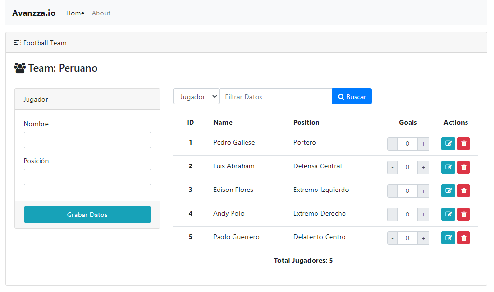
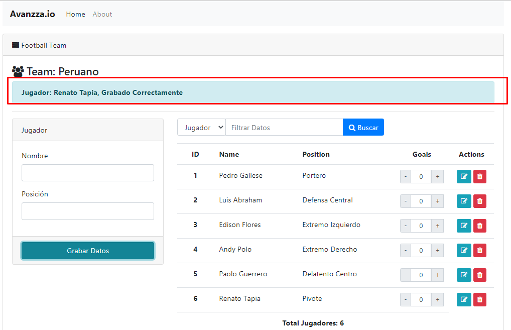

# Aplicación para registrar jugadores con Vue.js y Vuex

##### Descripción:

Esta es una aplicación frontend que permite registrar, modificar, eliminar y filtrar jugadores de fútbol

##### Detalle de Implementación usando (Props,Computed,Componentes y Vuex):

- Se ha creado el componente **_team_** el cual muestra una tabla o listado con los nombres de algunos jugadores de la selección
- Los jugadores estarán almacenados en un archivo js dentro de una carpeta **_constants_**. Los datos a desplegar son nombre, posición, cantidad de goles (en cero por default)
- Dentro del listado existen 2 botones para incrementar y disminuir la cantidad de goles del jugador. Este botón está implementado en un componente **_goals_** (con la finalidad de aumentar/disminuir los goles del jugador)
- El listado de jugadores cuenta con un filtro por nombre de jugador y posición
- Se utiliza una propiedad computada para mostrar la cantidad de jugadores.
- Existe un componente **_alert_** que permite mostrar un mensaje cuando se agregar, modifica y/o elimina un jugador.

### Técnologia empleada

- [VueJS]
- [Vuex]
- [Bootstrap]

### Instalación

Instale las dependencias y devDependencies e inicie el servidor.

```sh
$ npm install
```

### Compila y recarga los archivos en modo Desarrollo

```
$ npm run serve
```

### Compila y Minimiza los archivos para el despliegue de Producción

```
$ npm run build
```

## Frontend de la Aplicacion





**Free Software**

[//]: #
[vuejs]: https://vuejs.org/
[vuex]: https://vuex.vuejs.org/
[bootstrap]: https://getbootstrap.com/
